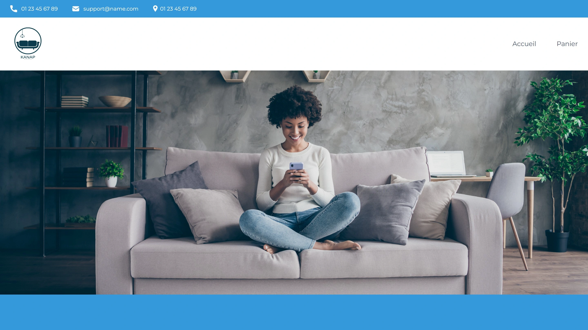

<div align="center">
    <a href="" target="_blank">
      
    </a>
  <h3 align="center">Kanap E-Commerce</h3>
  <h4 align="center">School Project</h4>
</div>

## <br /> 📋 <a name="table">Table of Contents</a>

- ✨ [Introduction](#introduction)
- ⚙️ [Tech Stack](#tech-stack)
- 📝 [Features](#features)
- 🚀 [Quick Start](#quick-start)

## <br /> <a name="introduction">✨ Introduction</a>

**[EN]** For more information, see the [docs](/docs/) folder.

**[FR]** Pour plus d'informations, consultez le dossier [docs](/docs/).

## <br /> <a name="tech-stack">⚙️ Tech Stack</a>

- **React** is a popular JavaScript library for building user interfaces, particularly single-page applications where data changes over time. React's component-based architecture allows developers to create reusable UI components, making development more efficient and the codebase easier to maintain.

## <br/> <a name="features">📝 Features</a>

## <br /> <a name="quick-start">🚀 Quick Start</a>

Follow these steps to set up the project locally on your machine.

<br/>**Prerequisites**

Make sure you have the following installed on your machine:

- [Git](https://git-scm.com/)
- [Node.js](https://nodejs.org/en)
- [npm](https://www.npmjs.com/) (Node Package Manager)

Install nodemon globally on your machine, open your terminal and run the following command:

```bash
npm install -g nodemon
```

- **Nodemon** is a tool that helps develop Node.js based applications by automatically restarting the node application when file changes in the directory are detected.

<br/>**Cloning the Repository**

```bash
git clone {git remote URL}
```

<br/>**Installation**

Let's install the project dependencies, from your terminal, run:

```bash
npm install
# or
yarn install
```

<br/>**Running the Project**

Installation will take a minute or two, but once that's done, you should be able to run the following command:

```bash
npm run dev
# or
yarn dev
```

- **Client**: Use [Live Server](https://marketplace.visualstudio.com/items?itemName=ritwickdey.LiveServer) to launch a development local server with live reload feature for static & dynamic pages.

- **Server**: Running on [`http://localhost:3000`](http://localhost:3000)

Open [`http://localhost:3000`](http://localhost:3000) in your browser to view the project.

# Kanap

Quatrième projet du parcours "Développeur web" chez OpenClassrooms.

L'objectif est de construire un site e-commerce en Vanilla JavaScript .

- [Cahier des charges](notes/Kanap%20-%20Specifications%20fonctionnelles.pdf)

- [Plan de test d'acceptation](notes/Kanap%20-%20Plan%20de%20test%20d'acceptation.pdf)

- [Aspect visuel du site](notes/Kanap%20-%20Aspect%20visuel.pdf)


# Lancement

- Prérequis : Node.js et NPM installés sur votre ordinateur

- Installation Backend : Depuis le dossier "back", lancez "npm install" depuis votre environnement de développement/Terminal.

- Lancement Serveur : Depuis le dossier "back", lancez "node serveur.js" depuis votre environnement de développement/Terminal.

- Le serveur devrait se lancer sur localhost port 3000 par défaut. Vous pouvez utiliser l'extension VSCode "Live Server" pour lancer le site depuis "index.html".

# Compétences évaluées

- Créer un serveur web simple avec Express
- Créer une API REST avec Node, Express et MongoDB
- Mettre en place un système d'authentification sur une application Express
- Gérer des fichiers utilisateur sur une application Express
- Interagir avec un web service avec JavaScript
- Valider des données issues de sources externes
- Créer un plan de test pour une application
- Gérer des événements JavaScript

# Technologies

**Utilisées :**

- JavaScript Vanilla
- Node.js (API)
- HTML / CSS (Responsive)

**Interdites :**

- Framework JavaScript

# Scénario

Vous êtes en poste dans une agence de développement web depuis quelques semaines maintenant. Après avoir réalisé avec succès l’intégration de quelques sites web (HTML/CSS), on vous confie une nouvelle mission.

Votre client est Kanap, une marque de canapés qui vend ses produits depuis sa boutique exclusivement. Aujourd’hui, celle-ci souhaiterait avoir une plateforme de e-commerce en plus de sa boutique physique pour vendre ses produits sur Internet.

# Livrables

- **Page d’accueil**

1. Affichage dynamique des produits via l'utilisation de l'API Fetch.

- **Page Produit**

1. Affichage dynamique du produit choisi sur l'accueil via l'utilisation de l'API Fetch.
2. Système d'ajout Panier via l'utilisation du localStorage.

- **Page Panier**

1. Affichage dynamique des produits ajoutés au Panier.
2. Calcul dynamique des totaux prix/quantité d'articles.
3. Modification de la quantité, suppression d'article, depuis le Panier.
4. Formulaire de commande, utilisation de REGEX.
5. Récupérer un numéro de commande envoyé par l'API après succès de l'achat.
